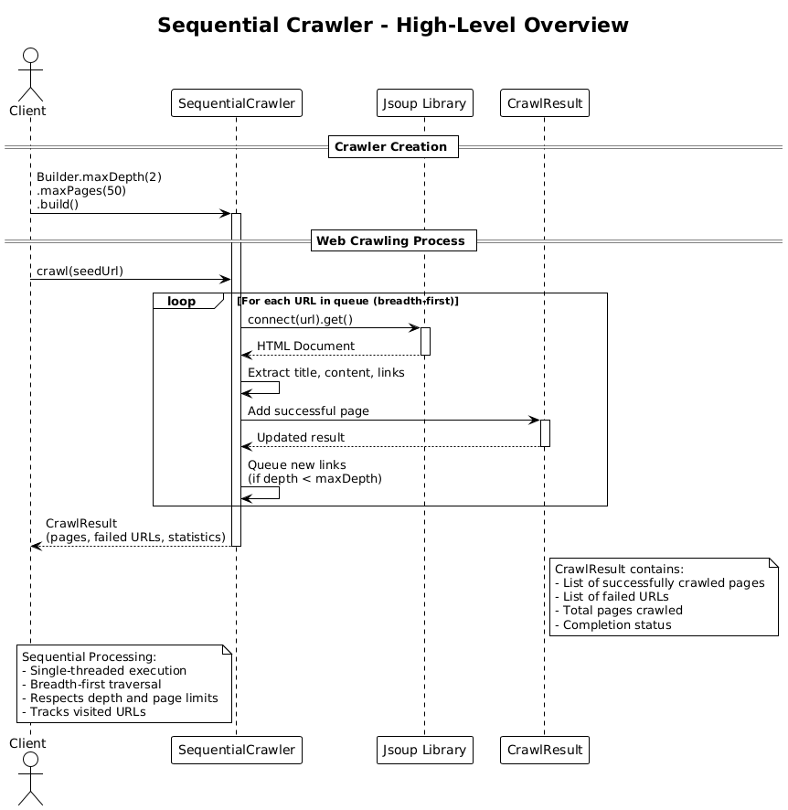
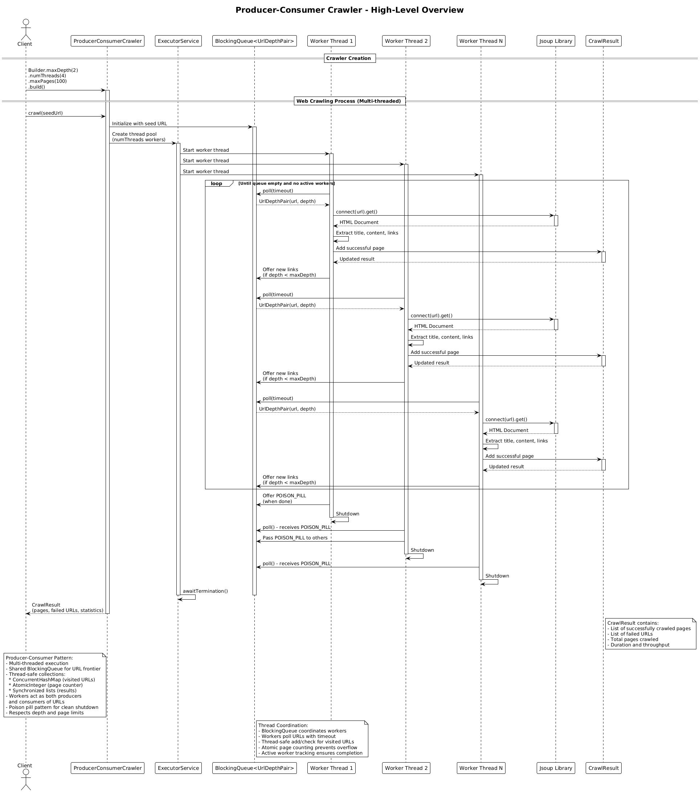
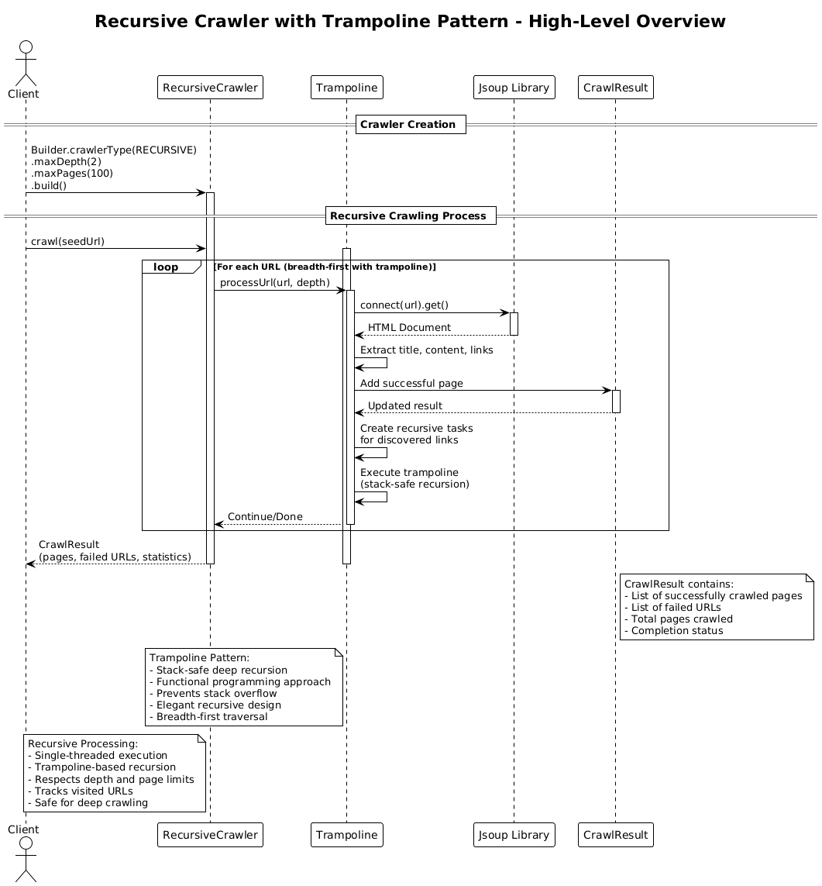
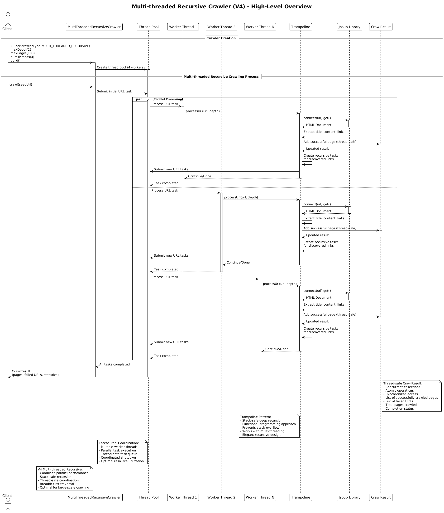
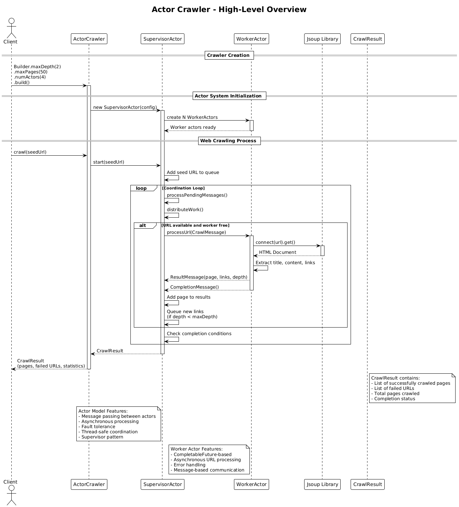
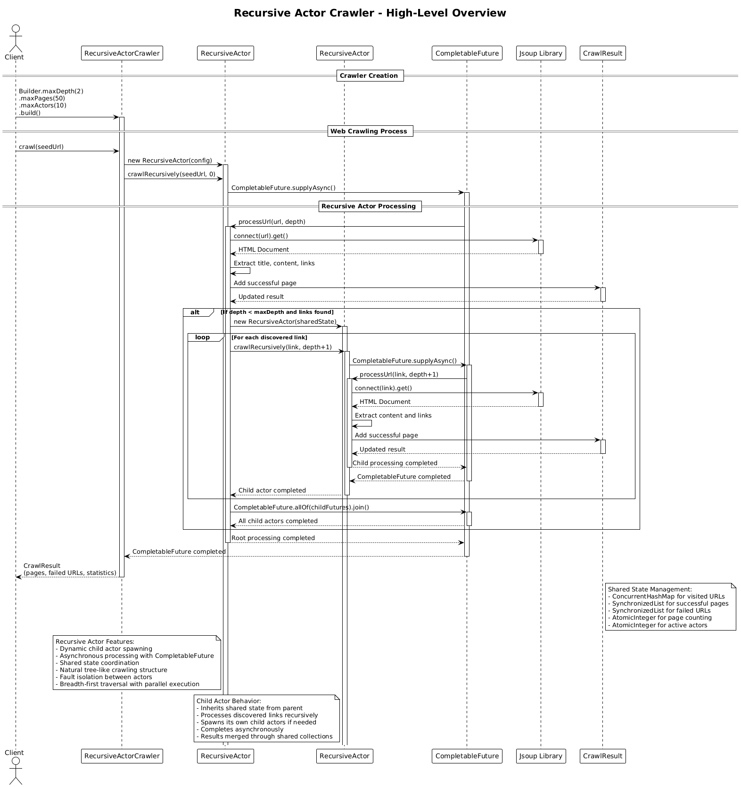
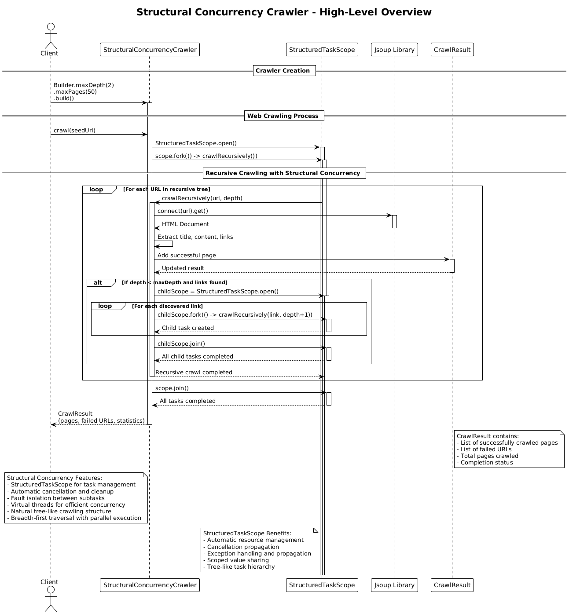

# Web Crawler Architecture Overview

This document explains the seven different web crawler implementations in this project: the Sequential Crawler (v1), Producer-Consumer Crawler (v2), Recursive Crawler (v3), Multi-threaded Recursive Crawler (v4), Actor Crawler (v5), Recursive Actor Crawler (v6), and Structural Concurrency Crawler (v7). All approaches solve the same problem—crawling web pages starting from a seed URL—but use fundamentally different architectural patterns and concurrency models.

## Sequential Crawler (v1)

### Core Concept

The Sequential Crawler implements a **single-threaded, breadth-first traversal** pattern. It processes web pages one at a time in a simple, linear fashion.

### How It Works

1. **Initialization**: The client creates a crawler using the builder pattern, specifying constraints like maximum depth and maximum pages.

2. **Processing Loop**:
   - Starting with the seed URL, the crawler maintains a queue of URLs to visit
   - For each URL in the queue:
     - Fetch the HTML document using Jsoup
     - Extract the page title and content
     - Parse all links on the page
     - Add the page to the result set
     - Queue new discovered links (if depth limit allows)
   - Continue until the queue is empty or limits are reached

3. **Result**: Returns a `CrawlResult` containing all crawled pages, failed URLs, and statistics.

### Key Characteristics

- **Simple Architecture**: Linear flow from client → crawler → Jsoup → result
- **Breadth-First Traversal**: Processes all pages at depth N before moving to depth N+1
- **Predictable Execution**: Deterministic order of page visits
- **Low Complexity**: Easy to understand, debug, and maintain
- **Resource Efficient**: Minimal memory and thread overhead

### Diagram Reference

See [sequential-crawler-overview.png](./sequential-crawler-overview.png) for the detailed sequence diagram.

---

## Producer-Consumer Crawler (v2)

### Core Concept

The Producer-Consumer Crawler implements a **multi-threaded, parallel processing** pattern. It uses multiple worker threads that simultaneously crawl different pages, dramatically improving throughput for large-scale crawling.

### How It Works

1. **Initialization**:
   - The client creates a crawler specifying max depth, max pages, and **number of threads**
   - An `ExecutorService` thread pool is created with N worker threads
   - A shared `BlockingQueue` serves as the URL frontier

2. **Parallel Processing**:
   - The seed URL is added to the queue
   - Worker threads continuously poll the queue for URLs to process
   - Each worker:
     - Takes a URL from the queue (blocks if empty)
     - Fetches and parses the page with Jsoup
     - Extracts content and links
     - Adds the page to thread-safe result collections
     - **Produces** new URLs by adding discovered links back to the queue (if depth allows)
   - This continues until all URLs are processed and the queue is empty

3. **Thread Coordination**:
   - **ConcurrentHashMap** tracks visited URLs (thread-safe)
   - **AtomicInteger** counts pages without race conditions
   - **Synchronized lists** store results safely
   - Active worker tracking ensures no premature shutdown

4. **Clean Shutdown**:
   - Uses the **poison pill pattern**: a sentinel value that signals workers to stop
   - When the last worker finishes, it adds the poison pill to the queue
   - Other workers pass it along before terminating
   - The executor awaits termination of all threads

5. **Result**: Returns a `CrawlResult` with pages, failures, and performance statistics (duration, throughput).

### Key Characteristics

- **High Throughput**: Multiple pages processed simultaneously
- **Producer-Consumer Pattern**: Workers both consume URLs and produce new ones
- **Thread-Safe Design**: Uses concurrent collections and atomic operations
- **Scalable**: Performance scales with thread count (up to a point)
- **Complex Coordination**: Requires careful synchronization and shutdown logic
- **Non-Deterministic Order**: Pages may be crawled in unpredictable order

### Thread Safety Mechanisms

- **BlockingQueue**: Thread-safe URL frontier with built-in blocking operations
- **ConcurrentHashMap**: Lock-free visited URL tracking
- **AtomicInteger**: Lock-free page counting
- **Synchronized Collections**: Thread-safe result lists
- **Poison Pill Pattern**: Clean, coordinated shutdown without explicit locks

### Diagram Reference

See [producer-consumer-crawler-overview.png](./producer-consumer-crawler-overview.png) for the detailed sequence diagram showing multi-threaded interactions.

---

## Recursive Crawler (v3)

### Core Concept

The Recursive Crawler implements a **single-threaded, functional programming** pattern using the **trampoline technique**. It uses recursion to traverse the web graph while avoiding stack overflow through a sophisticated trampoline mechanism that converts recursive calls into iterative loops.

### How It Works

1. **Initialization**: The client creates a crawler using the builder pattern, specifying constraints like maximum depth and maximum pages.

2. **Trampoline Pattern**:
   - Instead of direct recursion, the crawler uses a `Trampoline` class that wraps recursive operations
   - Each recursive step returns either a `Done` result or a `More` continuation
   - The trampoline repeatedly executes continuations until a final result is reached
   - This prevents stack overflow even with deep recursion

3. **Recursive Processing**:
   - Starting with the seed URL, the crawler recursively processes each page
   - For each URL:
     - Fetch the HTML document using Jsoup
     - Extract the page title and content
     - Parse all links on the page
     - Add the page to the result set
     - Recursively process discovered links (if depth limit allows)
   - The trampoline ensures all recursive calls are stack-safe

4. **Result**: Returns a `CrawlResult` containing all crawled pages, failed URLs, and statistics.

### Key Characteristics

- **Functional Programming**: Elegant recursive design with immutable data structures
- **Stack Safety**: Trampoline pattern prevents stack overflow in deep recursion
- **Single-threaded**: Simple, predictable execution model
- **Breadth-First Traversal**: Processes pages level by level
- **Memory Efficient**: No explicit queue management needed
- **Elegant Code**: Clean, functional approach to web crawling

### Trampoline Pattern Benefits

- **Stack Safety**: Converts recursive calls into iterative loops
- **Deep Recursion**: Can handle arbitrarily deep web graphs
- **Functional Style**: Maintains the elegance of recursive programming
- **No Explicit Loops**: Recursive logic without manual iteration

### Diagram Reference

See [recursive-crawler-overview.png](./recursive-crawler-overview.png) for the detailed sequence diagram showing the trampoline pattern in action.

---

## Multi-threaded Recursive Crawler (v4)

### Core Concept

The Multi-threaded Recursive Crawler combines the **best of both worlds**: it merges the parallel processing power of the Producer-Consumer pattern with the elegant recursive design and stack safety of the trampoline pattern. This creates the most sophisticated and performant crawler implementation.

### How It Works

1. **Initialization**:
   - The client creates a crawler specifying max depth, max pages, and **number of threads**
   - An `ExecutorService` thread pool is created with N worker threads
   - A shared `BlockingQueue` serves as the URL frontier
   - Thread-safe collections manage shared state

2. **Hybrid Architecture**:
   - **Producer-Consumer Layer**: Multiple worker threads process URLs in parallel
   - **Recursive Layer**: Each worker uses trampoline pattern for stack-safe recursion
   - **Thread Coordination**: Synchronized access to shared resources

3. **Parallel Recursive Processing**:
   - The seed URL is added to the queue
   - Worker threads continuously poll the queue for URLs to process
   - Each worker:
     - Takes a URL from the queue (blocks if empty)
     - Uses trampoline pattern to recursively process the page
     - Fetches and parses the page with Jsoup
     - Extracts content and links
     - Adds the page to thread-safe result collections
     - **Produces** new URLs by adding discovered links back to the queue
   - This continues until all URLs are processed and the queue is empty

4. **Thread-Safe Trampoline**:
   - Each worker maintains its own trampoline instance
   - Shared state (visited URLs, results) is accessed through thread-safe collections
   - Recursive operations within each thread are stack-safe
   - No interference between parallel recursive operations

5. **Clean Shutdown**:
   - Uses the **poison pill pattern** for coordinated shutdown
   - Each worker completes its current recursive operation before terminating
   - The executor awaits termination of all threads

6. **Result**: Returns a `CrawlResult` with pages, failures, and performance statistics.

### Key Characteristics

- **Maximum Performance**: Parallel processing with stack-safe recursion
- **Hybrid Pattern**: Combines Producer-Consumer and Recursive patterns
- **Thread-Safe Recursion**: Multiple trampoline instances working in parallel
- **Scalable**: Performance scales with thread count
- **Stack Safety**: Deep recursion without stack overflow
- **Complex Coordination**: Sophisticated synchronization between threads

### Advanced Features

- **Parallel Trampolines**: Each thread has its own trampoline instance
- **Thread-Safe Collections**: ConcurrentHashMap, AtomicInteger, synchronized lists
- **Coordinated Shutdown**: Poison pill pattern with recursive operation completion
- **Optimal Resource Usage**: Balances parallelism with memory efficiency

### Diagram Reference

See [multi-threaded-recursive-crawler-overview.png](./multi-threaded-recursive-crawler-overview.png) for the detailed sequence diagram showing the hybrid architecture with parallel recursive processing.

---

## Actor Crawler (v5)

### Core Concept

The Actor Crawler implements the **Actor Model pattern** using **CompletableFuture-based actors** and **asynchronous message passing**. It uses a supervisor-worker architecture where actors communicate through immutable messages, providing fault tolerance, loose coupling, and high scalability for concurrent web crawling operations.

### How It Works

1. **Initialization**:
   - The client creates a crawler specifying max depth, max pages, and **number of actors**
   - A `SupervisorActor` is created to coordinate the crawling process
   - Multiple `WorkerActor` instances are created for parallel URL processing
   - Thread-safe collections manage shared state and message queues

2. **Actor System Architecture**:
   - **Supervisor Actor**: Coordinates the overall crawling process, manages worker actors, and aggregates results
   - **Worker Actors**: Process individual URLs asynchronously using CompletableFuture
   - **Message Passing**: Actors communicate through immutable message objects (CrawlMessage, ResultMessage, ErrorMessage, CompletionMessage)
   - **Asynchronous Processing**: All operations are non-blocking and use CompletableFuture for async execution

3. **Message-Driven Processing**:
   - The seed URL is wrapped in a `CrawlMessage` and sent to the supervisor
   - The supervisor distributes `CrawlMessage` objects to available worker actors
   - Each worker actor:
     - Receives a `CrawlMessage` with URL and depth information
     - Fetches and parses the page with Jsoup asynchronously
     - Extracts content and links
     - Sends back a `ResultMessage` with the page data and discovered links
     - Sends a `CompletionMessage` to signal task completion
   - The supervisor processes messages and queues new URLs for crawling

4. **Coordination Loop**:
   - The supervisor runs a coordination loop that:
     - Processes pending messages from worker actors
     - Distributes new work to available workers
     - Tracks visited URLs to avoid duplicates
     - Aggregates results from all workers
     - Detects when crawling is complete
   - Uses thread-safe collections for coordination without explicit locks

5. **Fault Tolerance**:
   - Each actor operates independently and can fail without affecting others
   - Error messages are handled gracefully and logged
   - The supervisor pattern provides fault isolation
   - Asynchronous processing prevents blocking on individual failures

6. **Result**: Returns a `CrawlResult` with pages, failures, and performance statistics.

### Key Characteristics

- **Actor Model**: Message-passing concurrency with no shared mutable state
- **Asynchronous Processing**: CompletableFuture-based actors for non-blocking operations
- **Fault Tolerance**: Supervisor pattern provides fault isolation and recovery
- **Loose Coupling**: Actors communicate only through immutable messages
- **High Scalability**: Can handle large numbers of concurrent operations
- **Thread-Safe Design**: Uses concurrent collections and atomic operations
- **Message-Driven**: All coordination happens through message passing

### Actor Model Benefits

- **No Shared State**: Actors don't share mutable state, eliminating race conditions
- **Fault Isolation**: Failure of one actor doesn't affect others
- **Location Transparency**: Actors can be distributed across different machines
- **Elastic Scaling**: Can dynamically add or remove actors based on load
- **Natural Concurrency**: Message passing is inherently concurrent and safe

### Message Types

- **CrawlMessage**: Request to crawl a specific URL at a given depth
- **ResultMessage**: Successful crawl result with page data and discovered links
- **ErrorMessage**: Error that occurred while crawling a URL
- **CompletionMessage**: Signal that a worker has completed its current task

### Diagram Reference

See [actor-crawler-overview.png](./actor-crawler-overview.png) for the detailed sequence diagram showing the actor model with message passing.

---

## Recursive Actor Crawler (v6)

### Core Concept

The Recursive Actor Crawler implements a **hybrid actor model with recursive design** that combines the best of both the Actor Model pattern and recursive programming. It uses dynamic actor spawning where each actor can recursively create child actors for discovered links, creating a natural tree-like crawling structure that matches the web topology.

### How It Works

1. **Initialization**:
   - The client creates a crawler specifying max depth, max pages, and **maximum number of actors**
   - A root `RecursiveActor` is created to coordinate the crawling process
   - Thread-safe collections manage shared state across all actors
   - An `ExecutorService` provides the execution context for asynchronous operations

2. **Recursive Actor Architecture**:
   - **Root Actor**: Starts the crawling process from the seed URL
   - **Child Actors**: Dynamically spawned for each discovered link
   - **Shared State**: All actors share thread-safe collections (visited URLs, results, counters)
   - **Asynchronous Processing**: Each actor uses `CompletableFuture` for non-blocking execution

3. **Recursive Processing Flow**:
   - The root actor processes the seed URL asynchronously
   - For each discovered link, a new child actor is spawned
   - Each child actor:
     - Processes its assigned URL asynchronously
     - Fetches and parses the page with Jsoup
     - Extracts content and links
     - Adds the page to shared result collections
     - Spawns its own child actors for discovered links (if depth allows)
   - This creates a natural tree structure matching the web topology

4. **Dynamic Actor Management**:
   - Actors are created on-demand based on discovered links
   - Each actor maintains a list of its child actors
   - Shared state coordination through thread-safe collections
   - Automatic cleanup when actors complete their work

5. **Fault Isolation and Coordination**:
   - Each actor operates independently and can fail without affecting others
   - Child actor failures are handled gracefully and logged
   - Shared state ensures consistent results across all actors
   - Asynchronous processing prevents blocking on individual failures

6. **Result**: Returns a `CrawlResult` with pages, failures, and performance statistics.

### Key Characteristics

- **Hybrid Architecture**: Combines Actor Model with recursive design
- **Dynamic Actor Spawning**: Actors created on-demand for discovered links
- **Natural Tree Structure**: Crawling structure matches web topology
- **Asynchronous Processing**: CompletableFuture-based actors for non-blocking operations
- **Fault Isolation**: Actor failures don't affect other branches
- **Shared State Coordination**: Thread-safe collections for consistent results
- **Stack-Safe Recursion**: Asynchronous execution prevents stack overflow
- **Resource Management**: Dynamic actor creation and cleanup

### Recursive Actor Benefits

- **Natural Structure**: Tree-like crawling matches web topology
- **Dynamic Scaling**: Actors created based on actual link discovery
- **Fault Tolerance**: Independent actor operation with graceful failure handling
- **Asynchronous Safety**: CompletableFuture prevents blocking and stack overflow
- **Shared Coordination**: Thread-safe state management across actors
- **Resource Efficiency**: Actors created only when needed

### Diagram Reference

See [recursive-actor-crawler-overview.png](./recursive-actor-crawler-overview.png) for the detailed sequence diagram showing the recursive actor model with dynamic spawning.

---

## Structural Concurrency Crawler (v7)

### Core Concept

The Structural Concurrency Crawler implements **Java 25's structural concurrency** using `StructuredTaskScope` for managing concurrent subtasks within well-defined scopes. It provides automatic resource management, cancellation propagation, and fault isolation while maintaining a natural tree-like crawling structure.

### How It Works

1. **Initialization**:
   - The client creates a crawler specifying max depth, max pages, and timeout settings
   - Thread-safe collections manage shared state for coordination
   - Virtual threads provide efficient concurrency without thread pool overhead

2. **Structured Concurrency Architecture**:
   - **StructuredTaskScope**: Manages concurrent subtasks within well-defined scopes
   - **Automatic Resource Management**: Scopes automatically clean up resources when closed
   - **Cancellation Propagation**: Cancellation automatically propagates to all subtasks
   - **Fault Isolation**: Failures in one branch don't affect others
   - **Virtual Threads**: Efficient concurrency without traditional thread pool overhead

3. **Recursive Processing with Structured Scopes**:
   - The main crawl operation creates a `StructuredTaskScope`
   - For each URL, the crawler recursively processes it within the scope
   - For discovered links, child scopes are created for parallel processing
   - Each scope manages its own set of concurrent subtasks
   - Automatic cleanup occurs when scopes close

4. **Structured Task Management**:
   - `scope.fork()` creates subtasks for concurrent execution
   - `scope.join()` waits for all subtasks to complete
   - Automatic cancellation when scope closes
   - Exception handling and propagation through scope hierarchy

5. **Virtual Thread Integration**:
   - Virtual threads provide efficient concurrency
   - No explicit thread pool management required
   - Automatic scaling based on workload
   - Reduced memory overhead compared to platform threads

6. **Result**: Returns a `CrawlResult` with pages, failures, and performance statistics.

### Key Characteristics

- **Structured Concurrency**: Java 25's StructuredTaskScope for task management
- **Automatic Resource Management**: Scopes handle cleanup automatically
- **Cancellation Propagation**: Automatic cancellation throughout scope hierarchy
- **Fault Isolation**: Failures isolated within scope boundaries
- **Virtual Threads**: Efficient concurrency without thread pool overhead
- **Natural Tree Structure**: Recursive scoping matches web topology
- **Simplified Error Handling**: Automatic exception propagation and handling
- **Modern Java Features**: Leverages latest Java concurrency improvements

### Structural Concurrency Benefits

- **Automatic Cleanup**: Resources managed automatically by scopes
- **Cancellation Safety**: Automatic cancellation propagation prevents resource leaks
- **Fault Isolation**: Scope boundaries provide natural fault isolation
- **Simplified Code**: Less boilerplate for concurrent operations
- **Virtual Thread Efficiency**: Better resource utilization than traditional threads
- **Exception Safety**: Automatic exception handling and propagation
- **Modern Design**: Leverages Java's latest concurrency features

### Diagram Reference

See [structural-concurrency-crawler-overview.png](./structural-concurrency-crawler-overview.png) for the detailed sequence diagram showing structured concurrency with automatic resource management.

---

## Comparison

| Aspect | Sequential Crawler (v1) | Producer-Consumer Crawler (v2) | Recursive Crawler (v3) | Multi-threaded Recursive Crawler (v4) | Actor Crawler (v5) | Recursive Actor Crawler (v6) | Structural Concurrency Crawler (v7) |
|--------|------------------------|--------------------------------|------------------------|--------------------------------------|-------------------|------------------------------|-----------------------------------|
| **Threading** | Single-threaded | Multi-threaded (configurable) | Single-threaded | Multi-threaded (configurable) | Multi-threaded (configurable) | Multi-threaded (configurable) | Multi-threaded (virtual threads) |
| **Throughput** | Low (one page at a time) | High (N pages simultaneously) | Low (one page at a time) | High (N pages simultaneously) | High (N actors simultaneously) | High (N actors simultaneously) | High (virtual threads) |
| **Complexity** | Simple | Complex | Medium | Very Complex | Very Complex | Very Complex | Medium |
| **Resource Usage** | Low | Higher (threads, memory) | Low | Higher (threads, memory) | Higher (actors, message queues) | Higher (actors, shared state) | Low (virtual threads) |
| **Order** | Deterministic breadth-first | Non-deterministic | Deterministic breadth-first | Non-deterministic | Non-deterministic | Non-deterministic | Non-deterministic |
| **Scalability** | Limited | Scales with cores/threads | Limited | Scales with cores/threads | Scales with actors (distributed) | Scales with actors (dynamic) | Scales with virtual threads |
| **Debugging** | Easy | More challenging | Medium | Most challenging | Most challenging | Most challenging | Medium |
| **Stack Safety** | N/A (iterative) | N/A (iterative) | Yes (trampoline) | Yes (trampoline) | N/A (iterative) | Yes (async recursion) | Yes (structured scopes) |
| **Programming Style** | Imperative | Imperative | Functional | Hybrid | Actor Model | Hybrid Actor-Recursive | Structured Concurrency |
| **Fault Tolerance** | None | Limited | None | Limited | High (supervisor pattern) | High (actor isolation) | High (scope isolation) |
| **Use Case** | Small sites, prototyping | Large sites, production | Deep sites, functional programming | Large deep sites, maximum performance | Distributed systems, fault-tolerant crawling | Tree-like sites, dynamic scaling | Modern Java, resource management |

## Architecture Insights

### Sequential Crawler Pattern

The sequential approach follows the classic **Queue-based BFS (Breadth-First Search)** algorithm:

```
Queue ← [seed URL]
Visited ← {}

while Queue is not empty:
    url ← dequeue()
    if url in Visited: continue

    page ← fetch(url)
    process(page)

    Visited.add(url)
    for link in page.links:
        if link not in Visited:
            enqueue(link)
```

### Producer-Consumer Pattern

The multi-threaded approach implements the classic **Producer-Consumer Pattern**:

```
Shared Queue ← [seed URL]
Visited ← ConcurrentHashMap

Workers (parallel):
    while true:
        url ← queue.poll(timeout)
        if url is POISON_PILL: break
        if url is null: continue

        if Visited.putIfAbsent(url): continue

        page ← fetch(url)
        results.add(page)  // synchronized

        for link in page.links:
            queue.offer(link)  // producer role
```

Key insight: Each worker is both a **consumer** (taking URLs from the queue) and a **producer** (adding discovered URLs to the queue), creating a dynamic work-stealing pattern.

### Recursive Pattern with Trampoline

The recursive approach implements the **Trampoline Pattern** for stack-safe recursion:

```
function crawlRecursive(url, depth):
    if depth > maxDepth: return Done(result)

    page ← fetch(url)
    result.add(page)

    tasks ← []
    for link in page.links:
        tasks.add(() -> crawlRecursive(link, depth + 1))

    return More(() -> trampoline(tasks))

// Trampoline execution
while (step = trampoline.step()) is More:
    trampoline = step.continuation()
return step.result()
```

Key insight: The trampoline converts recursive calls into iterative loops, preventing stack overflow while maintaining the elegance of functional programming.

### Multi-threaded Recursive Pattern

The hybrid approach combines **Producer-Consumer** and **Trampoline** patterns:

```
Shared Queue ← [seed URL]
Visited ← ConcurrentHashMap
Thread Pool ← N workers

Workers (parallel):
    while true:
        url ← queue.poll(timeout)
        if url is POISON_PILL: break

        // Each worker has its own trampoline
        trampoline ← new Trampoline()
        result ← trampoline.execute(() -> crawlRecursive(url, 0))

        for link in result.newLinks:
            queue.offer(link)  // producer role
```

Key insight: This hybrid pattern achieves maximum performance by combining parallel processing with stack-safe recursion, where each thread maintains its own trampoline instance.

### Actor Model Pattern

The actor-based approach implements the **Actor Model** with message passing:

```
SupervisorActor ← [seed URL]
MessageQueue ← []
WorkerActors ← [N actors]

Supervisor Loop:
    while not complete:
        processMessages()  // Handle ResultMessage, ErrorMessage, CompletionMessage
        distributeWork()   // Send CrawlMessage to available workers
        checkCompletion()  // Check if crawling is complete

Worker Actors (parallel):
    while active:
        message ← receive(CrawlMessage)
        page ← fetch(message.url)  // async with CompletableFuture
        links ← extractLinks(page)
        send(ResultMessage(page, links, depth))
        send(CompletionMessage())
```

Key insight: The actor model eliminates shared mutable state by using message passing, providing natural fault tolerance and the ability to scale across distributed systems.

### Recursive Actor Pattern

The recursive actor approach implements **Dynamic Actor Spawning** with shared state coordination:

```
RootActor ← [seed URL]
SharedState ← {visitedUrls, results, counters}
ChildActors ← []

function processUrl(url, depth):
    if depth > maxDepth: return

    page ← fetch(url)
    sharedState.results.add(page)

    for link in page.links:
        if not sharedState.visitedUrls.contains(link):
            childActor ← new RecursiveActor(sharedState)
            childActors.add(childActor)
            childActor.processUrl(link, depth + 1)  // async

    CompletableFuture.allOf(childActors).join()
```

Key insight: This pattern creates a natural tree structure where actors spawn child actors for discovered links, matching the web topology while maintaining shared state coordination.

### Structural Concurrency Pattern

The structural concurrency approach implements **StructuredTaskScope** for automatic resource management:

```
try (var scope = StructuredTaskScope.open()) {
    var mainTask = scope.fork(() -> crawlRecursively(seedUrl, 0))

    function crawlRecursively(url, depth):
        if depth > maxDepth: return

        page ← fetch(url)
        results.add(page)

        if depth < maxDepth:
            try (var childScope = StructuredTaskScope.open()) {
                for link in page.links:
                    childScope.fork(() -> crawlRecursively(link, depth + 1))
                childScope.join()  // automatic cleanup
            }

    scope.join()  // automatic cleanup
}
```

Key insight: StructuredTaskScope provides automatic resource management, cancellation propagation, and fault isolation, making concurrent programming safer and more predictable.

## Diagrams

All seven implementations are documented with PlantUML sequence diagrams:

1. **Sequential Crawler (v1)**: [sequential-crawler-overview.png](./sequential-crawler-overview.png)
   - Shows simple, linear flow
   - Single crawler instance handling all operations
   - 

2. **Producer-Consumer Crawler (v2)**: [producer-consumer-crawler-overview.png](./producer-consumer-crawler-overview.png)
   - Shows parallel worker threads
   - BlockingQueue coordination
   - Poison pill shutdown pattern
   - 

3. **Recursive Crawler (v3)**: [recursive-crawler-overview.png](./recursive-crawler-overview.png)
   - Shows trampoline pattern in action
   - Stack-safe recursive processing
   - Functional programming approach
   - 

4. **Multi-threaded Recursive Crawler (v4)**: [multi-threaded-recursive-crawler-overview.png](./multi-threaded-recursive-crawler-overview.png)
   - Shows hybrid architecture with parallel recursive processing
   - Thread-safe trampoline coordination
   - Maximum performance design
   - 

5. **Actor Crawler (v5)**: [actor-crawler-overview.png](./actor-crawler-overview.png)
   - Shows actor model with supervisor-worker pattern
   - Message passing between actors
   - Asynchronous processing with CompletableFuture
   - Fault-tolerant design
   - 

6. **Recursive Actor Crawler (v6)**: [recursive-actor-crawler-overview.png](./recursive-actor-crawler-overview.png)
   - Shows hybrid actor model with recursive design
   - Dynamic actor spawning for discovered links
   - Shared state coordination across actors
   - Natural tree-like crawling structure
   - 

7. **Structural Concurrency Crawler (v7)**: [structural-concurrency-crawler-overview.png](./structural-concurrency-crawler-overview.png)
   - Shows Java 25's StructuredTaskScope in action
   - Automatic resource management and cleanup
   - Virtual threads for efficient concurrency
   - Fault isolation through scope boundaries
   - 

## Conclusion

All seven crawlers share the same public API and produce the same `CrawlResult` structure, making them interchangeable from a client perspective. The choice between them depends on your specific requirements:

- **Choose Sequential (v1)** for simplicity, predictability, and smaller crawling tasks
- **Choose Producer-Consumer (v2)** for performance, scalability, and large-scale crawling operations
- **Choose Recursive (v3)** for elegant functional programming and deep recursion without stack overflow
- **Choose Multi-threaded Recursive (v4)** for maximum performance with stack-safe deep recursion
- **Choose Actor (v5)** for fault-tolerant, distributed systems and message-driven concurrency
- **Choose Recursive Actor (v6)** for tree-like sites with dynamic actor spawning and natural web topology matching
- **Choose Structural Concurrency (v7)** for modern Java applications requiring automatic resource management and virtual thread efficiency

The project demonstrates how the same problem can be solved with different architectural patterns and concurrency models:

- **v1**: Simple iterative approach with queue-based BFS
- **v2**: Multi-threaded producer-consumer pattern for parallel processing
- **v3**: Functional programming with trampoline pattern for stack-safe recursion
- **v4**: Hybrid approach combining parallel processing with stack-safe recursion
- **v5**: Actor model with message passing for fault-tolerant distributed systems
- **v6**: Hybrid actor-recursive model with dynamic spawning for natural tree structures
- **v7**: Java 25's structural concurrency with automatic resource management and virtual threads

Each implementation offers unique tradeoffs between simplicity, performance, fault tolerance, and programming paradigm, showcasing different approaches to solving complex concurrent programming challenges. The evolution from v1 to v7 demonstrates the progression of Java concurrency features and design patterns, from simple sequential processing to modern structured concurrency with automatic resource management.
