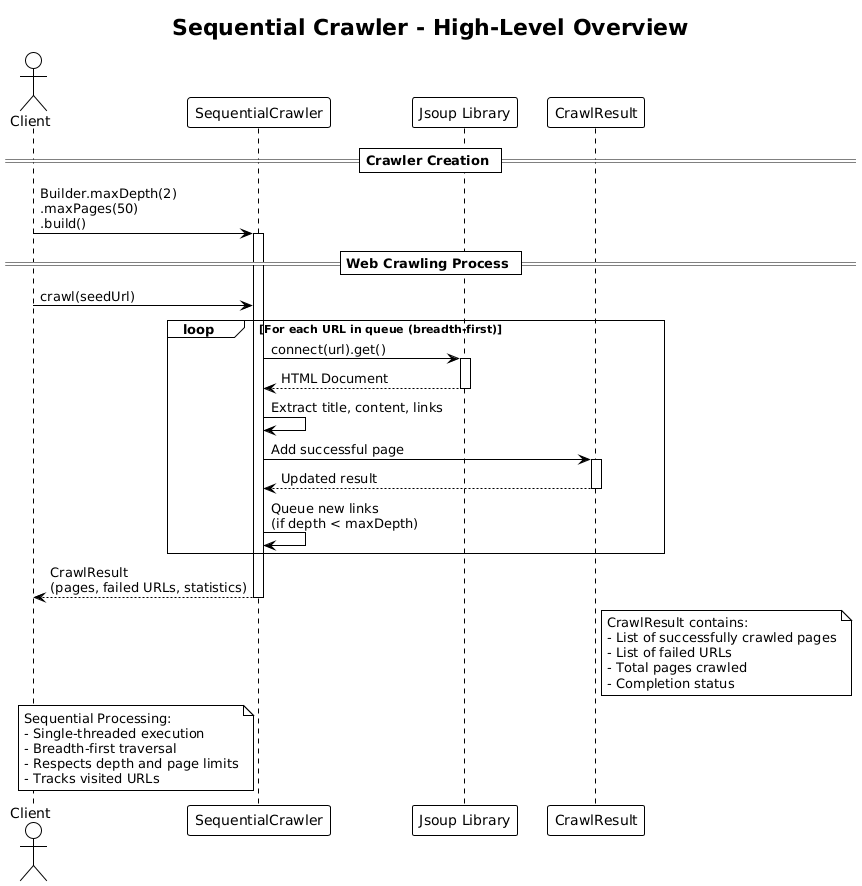

# Sequential Crawler (v1)

## Core Concept

The Sequential Crawler implements a **single-threaded, breadth-first traversal** pattern. It processes web pages one at a time in a simple, linear fashion.

## How It Works

1. **Initialization**: The client creates a crawler using the builder pattern, specifying constraints like maximum depth and maximum pages.

2. **Processing Loop**:
   - Starting with the seed URL, the crawler maintains a queue of URLs to visit
   - For each URL in the queue:
     - Fetch the HTML document using Jsoup
     - Extract the page title and content
     - Parse all links on the page
     - Add the page to the result set
     - Queue new discovered links (if depth limit allows)
   - Continue until the queue is empty or limits are reached

3. **Result**: Returns a `CrawlResult` containing all crawled pages, failed URLs, and statistics.

## Key Characteristics

- **Simple Architecture**: Linear flow from client → crawler → Jsoup → result
- **Breadth-First Traversal**: Processes all pages at depth N before moving to depth N+1
- **Predictable Execution**: Deterministic order of page visits
- **Low Complexity**: Easy to understand, debug, and maintain
- **Resource Efficient**: Minimal memory and thread overhead

## Architecture Pattern

The sequential approach follows the classic **Queue-based BFS (Breadth-First Search)** algorithm:

```
Queue ← [seed URL]
Visited ← {}

while Queue is not empty:
    url ← dequeue()
    if url in Visited: continue

    page ← fetch(url)
    process(page)

    Visited.add(url)
    for link in page.links:
        if link not in Visited:
            enqueue(link)
```

## Diagram Reference



## Use Case

Choose Sequential (v1) for simplicity, predictability, and smaller crawling tasks.
