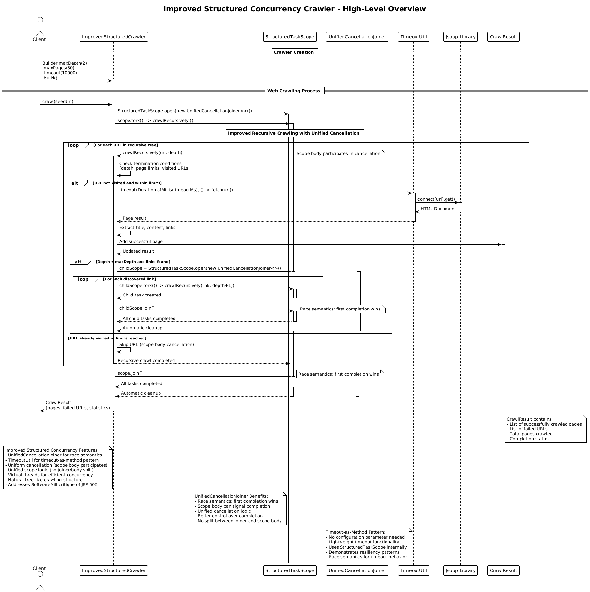

# Improved Structured Concurrency Crawler (v11)

## Core Concept

The Improved Structured Concurrency Crawler addresses the **SoftwareMill critique of JEP 505 Structured Concurrency** by implementing a custom `UnifiedCancellationJoiner` with race semantics, timeout-as-method patterns, and unified scope logic. This implementation demonstrates how to overcome the limitations identified in the [SoftwareMill article](https://softwaremill.com/critique-of-jep-505-structured-concurrency-fifth-preview/) while maintaining the benefits of structured concurrency.

## How It Works

1. **Initialization**:
   - The client creates a crawler specifying max depth, max pages, and timeout settings
   - Thread-safe collections manage shared state for coordination
   - Virtual threads provide efficient concurrency without thread pool overhead

2. **Improved Structured Concurrency Architecture**:
   - **UnifiedCancellationJoiner**: Custom Joiner with race semantics for better control
   - **TimeoutUtil**: Timeout-as-method pattern without configuration parameters
   - **Uniform Cancellation**: Scope body participates in error handling like subtasks
   - **Unified Scope Logic**: No split between Joiner implementation and scope body
   - **Virtual Threads**: Efficient concurrency without traditional thread pool overhead

3. **Recursive Processing with Improved Scopes**:
   - The main crawl operation creates a `StructuredTaskScope` with custom joiner
   - For each URL, the crawler recursively processes it within the scope
   - For discovered links, child scopes are created for parallel processing
   - Each scope manages its own set of concurrent subtasks with race semantics
   - Automatic cleanup occurs when scopes close

4. **Unified Cancellation and Scope Logic**:
   - `UnifiedCancellationJoiner` provides race semantics: first completion wins
   - Scope body can signal completion to cancel remaining work
   - All tasks (including scope body) participate in error handling uniformly
   - No split between Joiner logic and scope body logic
   - Custom joiner allows scope body to control when work is complete

5. **Timeout-as-Method Pattern**:
   - `TimeoutUtil.timeout()` provides lightweight timeout functionality
   - No special configuration parameter needed
   - Uses StructuredTaskScope with race semantics internally
   - Demonstrates general pattern for resiliency (retry, repeat, etc.)

6. **Result**: Returns a `CrawlResult` with pages, failures, and performance statistics.

## Key Characteristics

- **Addresses SoftwareMill Critique**: Implements solutions to all major JEP 505 limitations
- **Uniform Cancellation**: Scope body participates in error handling like subtasks
- **Unified Scope Logic**: No split between Joiner implementation and scope body
- **Timeout as Method**: Lightweight timeout pattern without configuration parameter
- **Custom Joiner**: Race semantics for better control over completion logic
- **Virtual Threads**: Efficient concurrency without thread pool overhead
- **Natural Tree Structure**: Recursive scoping matches web topology
- **Simplified Error Handling**: Automatic exception propagation and handling
- **Modern Java Features**: Leverages Java 25's structured concurrency improvements

## SoftwareMill Critique Solutions

### Critique #1: Non-uniform Cancellation
**Problem**: Scope body doesn't participate in error handling mechanisms of subtasks.

**Solution**:
- Scope body can signal completion to cancel remaining subtasks
- All tasks (including scope body) participate in error handling uniformly
- `UnifiedCancellationJoiner` provides race semantics for unified cancellation

### Critique #2: Scope Logic Split
**Problem**: Logic split between Joiner implementation and scope body makes it hard for scope body to cancel when job is done.

**Solution**:
- `UnifiedCancellationJoiner` provides unified scope logic
- Scope body directly controls when work is complete
- No split between Joiner implementation and scope body
- Cleaner separation of concerns

### Critique #3: Redundant Timeout Configuration
**Problem**: Dedicated timeout configuration parameter is redundant when timeout can be implemented using StructuredTaskScope mechanisms.

**Solution**:
- `TimeoutUtil.timeout()` implements timeout-as-method pattern
- No special configuration parameter needed
- Uses StructuredTaskScope with race semantics internally
- More lightweight and consistent with existing abstractions

### Critique #4: Confusing Method Naming
**Problem**: `Subtask.get()` has different semantics than `Future.get()` (non-blocking vs blocking).

**Solution**:
- Custom `UnifiedCancellationJoiner` provides clear completion semantics
- Race semantics make completion behavior explicit
- Better control over when and how tasks complete

## Improved Structured Concurrency Benefits

- **Automatic Cleanup**: Resources managed automatically by scopes
- **Cancellation Safety**: Automatic cancellation propagation prevents resource leaks
- **Fault Isolation**: Scope boundaries provide natural fault isolation
- **Simplified Code**: Less boilerplate for concurrent operations
- **Virtual Thread Efficiency**: Better resource utilization than traditional threads
- **Exception Safety**: Automatic exception handling and propagation
- **Modern Design**: Leverages Java's latest concurrency features
- **Better Control**: Custom joiner provides race semantics and unified cancellation

## Architecture Pattern

The improved structured concurrency approach implements **UnifiedCancellationJoiner** with race semantics:

```
try (var scope = StructuredTaskScope.open(new UnifiedCancellationJoiner<>())) {
    var mainTask = scope.fork(() -> crawlRecursively(seedUrl, 0))

    function crawlRecursively(url, depth):
        // Scope body participates in cancellation
        if depth > maxDepth: return
        if pagesCrawled >= maxPages: return

        // Use timeout-as-method pattern
        page ← TimeoutUtil.timeout(Duration.ofMillis(timeoutMs), () -> fetch(url))
        results.add(page)

        if depth < maxDepth:
            try (var childScope = StructuredTaskScope.open(new UnifiedCancellationJoiner<>())) {
                for link in page.links:
                    childScope.fork(() -> crawlRecursively(link, depth + 1))
                childScope.join()  // race semantics: first completion wins
            }

    scope.join()  // race semantics: first completion wins
}
```

Key insight: The `UnifiedCancellationJoiner` provides race semantics and unified cancellation, allowing the scope body to participate in error handling and control when work is complete, addressing all major critiques of JEP 505.

## Diagram Reference



## Use Case

Choose Improved Structured Concurrency (v11) for applications that want to leverage the benefits of structured concurrency while addressing the limitations identified in the SoftwareMill critique. This implementation provides better control over completion logic, unified cancellation, and demonstrates modern patterns for resilient concurrent programming.

## Reference

- [SoftwareMill Critique of JEP 505: Structured Concurrency (Fifth Preview)](https://softwaremill.com/critique-of-jep-505-structured-concurrency-fifth-preview/)
- [JEP 505: Structured Concurrency (Preview)](https://openjdk.org/jeps/505)
