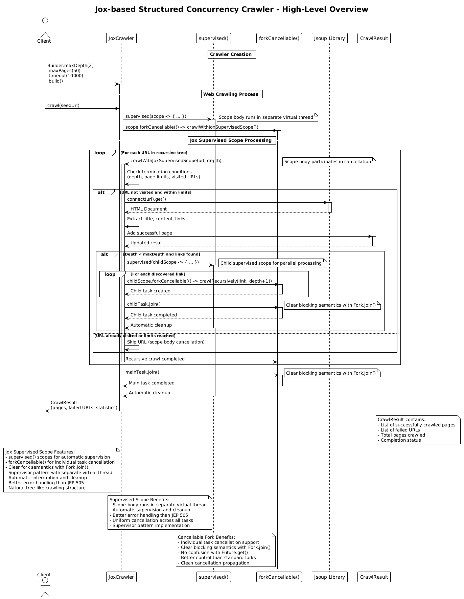

# Jox-based Structured Concurrency Crawler (v12)

## Core Concept

The Jox-based Structured Concurrency Crawler implements **SoftwareMill's Jox library** for supervised scopes, addressing the SoftwareMill critique of JEP 505 by providing a programmer-friendly API for structured concurrency. It uses `supervised()` scopes with `forkCancellable()` and built-in timeout mechanisms to provide better control, clearer semantics, and automatic resource management.

## How It Works

1. **Initialization**:
   - The client creates a crawler specifying max depth, max pages, and timeout settings
   - Thread-safe collections manage shared state for coordination
   - Virtual threads provide efficient concurrency without thread pool overhead

2. **Jox Supervised Scope Architecture**:
   - **Supervised Scopes**: `supervised()` creates supervised scopes with automatic supervision
   - **Cancellable Forks**: `forkCancellable()` provides individual task cancellation support
   - **Clear Semantics**: `Fork.join()` provides clear blocking behavior (unlike `Subtask.get()`)
   - **Automatic Interruption**: Supervisor handles scope body interruption
   - **User vs Daemon Forks**: Control which forks must complete

3. **Recursive Processing with Jox Scopes**:
   - The main crawl operation creates a `supervised()` scope
   - For each URL, the crawler recursively processes it within the scope
   - For discovered links, child scopes are created for parallel processing
   - Each scope manages its own set of concurrent subtasks with cancellation support
   - Automatic cleanup occurs when scopes close

4. **Supervisor Pattern with Jox**:
   - Scope body runs in separate virtual thread (supervisor pattern)
   - Automatic supervision and cleanup by Jox
   - Better error handling than JEP 505 StructuredTaskScope
   - Uniform cancellation across all tasks

5. **Result**: Returns a `CrawlResult` with pages, failures, and performance statistics.

## Key Characteristics

- **Jox Supervised Scopes**: Uses SoftwareMill's Jox library for structured concurrency
- **Cancellable Forks**: Individual task cancellation support with `forkCancellable()`
- **Clear Semantics**: `Fork.join()` provides clear blocking behavior
- **Automatic Supervision**: Scope body runs in separate virtual thread with automatic supervision
- **Better Error Handling**: Automatic cleanup and better error propagation than JEP 505
- **Virtual Thread Efficiency**: Efficient concurrency without thread pool overhead
- **Natural Tree Structure**: Recursive scoping matches web topology
- **Modern Java Features**: Leverages Jox's improvements over JEP 505

## Jox Advantages over JEP 505

### 1. Supervised Scopes
**JEP 505 Problem**: Scope body doesn't participate in error handling mechanisms of subtasks.

**Jox Solution**:
- Scope body runs in separate virtual thread (supervisor pattern)
- Automatic supervision and cleanup
- Better error handling than JEP 505
- Uniform cancellation across all tasks

### 2. Cancellable Forks
**JEP 505 Problem**: Limited control over individual task cancellation.

**Jox Solution**:
- `forkCancellable()` provides individual task cancellation support
- Better control than standard forks
- Clean cancellation propagation
- More granular control over task lifecycle

### 3. Clear Fork Semantics
**JEP 505 Problem**: `Subtask.get()` has different semantics than `Future.get()` (non-blocking vs blocking).

**Jox Solution**:
- `Fork.join()` provides clear blocking behavior
- Natural blocking semantics
- No confusion with `Future.get()`
- Clear completion semantics

### 4. User vs Daemon Forks
**JEP 505 Problem**: Limited control over which tasks must complete.

**Jox Solution**:
- `forkUser()` for required tasks
- `fork()` for background tasks
- Better control than JEP 505
- More flexible task management

## Architecture Pattern

The Jox-based approach implements **Supervised Scopes** with cancellable forks:

```java
supervised(scope -> {
    // Scope body runs in separate virtual thread (supervisor pattern)
    var mainTask = scope.forkCancellable(() -> {
        crawlWithJoxSupervisedScope(seedUrl, 0);
    });
    
    // Clear blocking semantics
    mainTask.join();
});

function crawlWithJoxSupervisedScope(url, depth):
    if depth > maxDepth: return
    if pagesCrawled >= maxPages: return
    
    page ← fetch(url)
    results.add(page)
    
    if depth < maxDepth:
        supervised(childScope -> {
            for link in page.links:
                // Cancellable forks for individual task cancellation
                var childTask = childScope.forkCancellable(() -> {
                    crawlWithJoxSupervisedScope(link, depth + 1);
                });
                childTasks.add(childTask);
            
            // Clear blocking semantics
            for (var childTask : childTasks) {
                childTask.join();
            }
        });
```

Key insight: Jox's supervised scopes provide automatic supervision, cancellable forks, and clear semantics, addressing all major critiques of JEP 505 while maintaining the benefits of structured concurrency.

## Diagram Reference



## Use Case

Choose Jox-based Structured Concurrency (v12) for applications that want to leverage the benefits of structured concurrency while addressing the limitations identified in the SoftwareMill critique. This implementation provides better control over task lifecycle, clearer semantics, and demonstrates how to use Jox's supervised scopes for robust concurrent programming.

## Key Benefits

- **Automatic Supervision**: Resources managed automatically by supervised scopes
- **Individual Task Cancellation**: `forkCancellable()` provides granular control
- **Clear Semantics**: `Fork.join()` provides clear blocking behavior
- **Better Error Handling**: Automatic cleanup and better error propagation
- **Virtual Thread Efficiency**: Better resource utilization than traditional threads
- **Supervisor Pattern**: Scope body runs in separate virtual thread
- **Modern Design**: Leverages Jox's improvements over JEP 505

## Comparison with V11

| Feature | V11 (JEP 505) | V12 (Jox) |
|---------|---------------|-----------|
| Scope Management | StructuredTaskScope | supervised() scopes |
| Task Cancellation | Custom Joiner | forkCancellable() |
| Fork Semantics | Subtask.get() | Fork.join() |
| Scope Body | Same thread | Separate virtual thread |
| Error Handling | Custom implementation | Automatic supervision |
| Timeout | Custom TimeoutUtil | Built-in mechanisms |
| Control | Limited | Granular with user/daemon forks |

## Reference

- [SoftwareMill Critique of JEP 505: Structured Concurrency (Fifth Preview)](https://softwaremill.com/critique-of-jep-505-structured-concurrency-fifth-preview/)
- [Jox Library - Programmer-friendly Structured Concurrency for Java](https://github.com/softwaremill/jox)
- [JEP 505: Structured Concurrency (Preview)](https://openjdk.org/jeps/505)
