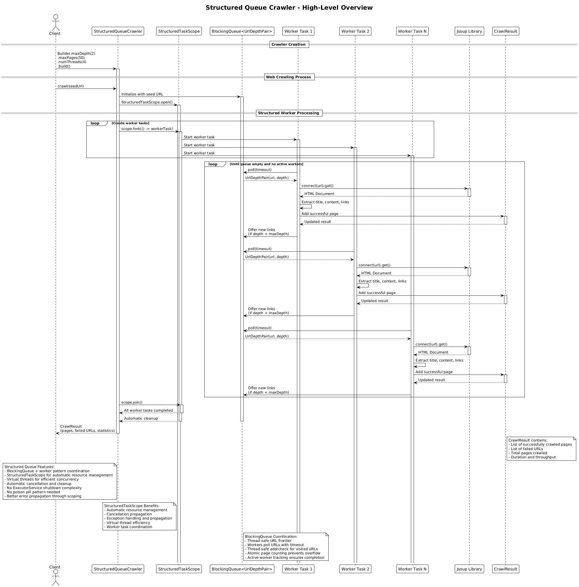

# Structured Queue Crawler (v13)

## Core Concept

The Structured Queue Crawler implements a **hybrid approach** that combines the proven **BlockingQueue + worker pattern** from ProducerConsumerCrawler (V2) with Java 25's **StructuredTaskScope** for automatic resource management. It provides the best of both worlds: the performance and coordination benefits of the producer-consumer pattern with the modern resource management capabilities of structured concurrency.

## How It Works

1. **Initialization**:
   - The client creates a crawler specifying max depth, max pages, and **number of threads**
   - Thread-safe collections manage shared state (visited URLs, results, counters)
   - Virtual threads provide efficient concurrency without thread pool overhead

2. **Hybrid Architecture**:
   - **BlockingQueue Layer**: Proven URL frontier management with thread-safe coordination
   - **StructuredTaskScope Layer**: Automatic resource management and cleanup
   - **Worker Pattern**: Multiple virtual threads process URLs in parallel
   - **Resource Management**: Automatic cleanup and cancellation propagation through scopes

3. **Structured Worker Processing**:
   - The seed URL is added to a `BlockingQueue` (URL frontier)
   - Multiple worker tasks are created using `StructuredTaskScope.fork()`
   - Each worker:
     - Polls the queue for URLs to process (blocks if empty)
     - Fetches and parses the page with Jsoup using virtual threads
     - Extracts content and links
     - Adds the page to thread-safe result collections
     - **Produces** new URLs by adding discovered links back to the queue
   - Automatic cleanup occurs when the scope closes

4. **Structured Task Management**:
   - `StructuredTaskScope.open()` creates scopes for worker management
   - `scope.fork()` creates worker tasks for parallel URL processing
   - `scope.join()` waits for all workers to complete
   - Automatic cancellation when scope closes (no poison pill needed)
   - Exception handling and propagation through scope hierarchy

5. **Virtual Thread Integration**:
   - Virtual threads provide efficient concurrency
   - No explicit thread pool management required
   - Automatic scaling based on workload
   - Reduced memory overhead compared to platform threads

6. **Result**: Returns a `CrawlResult` with pages, failures, and performance statistics.

## Key Characteristics

- **Hybrid Pattern**: Combines BlockingQueue coordination with StructuredTaskScope execution
- **Automatic Resource Management**: Scopes handle cleanup automatically
- **Cancellation Propagation**: Automatic cancellation throughout scope hierarchy
- **Virtual Thread Efficiency**: Better resource utilization than traditional threads
- **Proven Coordination**: BlockingQueue-based URL frontier management
- **Simplified Error Handling**: Automatic exception propagation and handling
- **Modern Java Features**: Leverages Java 25's structured concurrency improvements

## Structured Queue Benefits

- **Best of Both Worlds**: Producer-consumer coordination with structured concurrency execution
- **Automatic Cleanup**: Resources managed automatically by scopes
- **No Shutdown Complexity**: No ExecutorService shutdown needed
- **No Poison Pills**: Use scope cancellation instead of poison pill pattern
- **Better Error Propagation**: Structured error handling through scoping
- **Virtual Thread Efficiency**: Better resource utilization than traditional threads
- **Exception Safety**: Automatic exception handling and propagation

## Key Advantages over V2 (ProducerConsumerCrawler)

- **No ExecutorService shutdown complexity**
- **No poison pill pattern needed (use scope cancellation)**
- **Automatic worker cleanup on scope exit**
- **Better exception handling through structured tasks**
- **Virtual threads for better resource utilization**

## Key Advantages over V9 (StructuredWorkerCrawler)

- **Simpler, more focused implementation**
- **Clearer worker pattern (V9 is more complex)**
- **Direct BlockingQueue usage like V2**
- **Easier to understand for developers familiar with V2**

## Architecture Pattern

The structured queue approach combines **BlockingQueue + Worker Pattern** with **StructuredTaskScope**:

```java
BlockingQueue ← [seed URL]
Visited ← ConcurrentHashMap
StructuredTaskScope ← []

try (var scope = StructuredTaskScope.open()) {
    // Create worker tasks
    for (int i = 0; i < numThreads; i++) {
        scope.fork(() -> {
            while (true) {
                url ← queue.poll(timeout)
                if (url is null): break

                page ← fetch(url)
                results.add(page)

                for link in page.links:
                    queue.offer(link)  // producer role
            }
            return null;
        });
    }

    scope.join()  // automatic cleanup
}
```

Key insight: This hybrid pattern provides the coordination benefits of the producer-consumer pattern with the resource management benefits of structured concurrency, creating a robust and efficient crawling system.

## Diagram Reference



## Use Case

Choose Structured Queue (v13) for applications that want the proven performance of the producer-consumer pattern with modern structured concurrency resource management.
