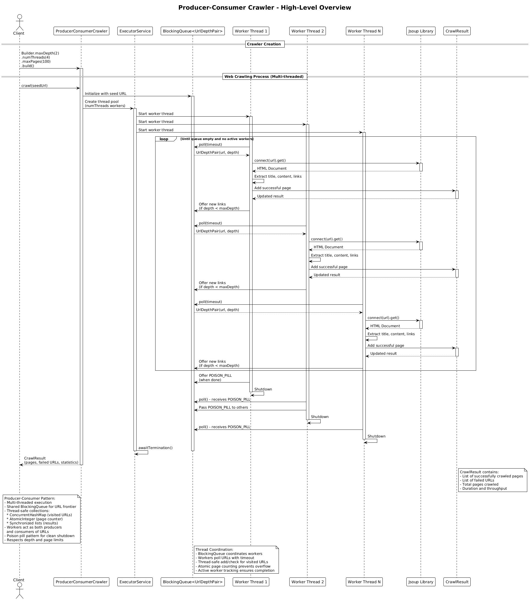

# Producer-Consumer Crawler (v2)

## Core Concept

The Producer-Consumer Crawler implements a **multi-threaded, parallel processing** pattern. It uses multiple worker threads that simultaneously crawl different pages, dramatically improving throughput for large-scale crawling.

## How It Works

1. **Initialization**:
   - The client creates a crawler specifying max depth, max pages, and **number of threads**
   - An `ExecutorService` thread pool is created with N worker threads
   - A shared `BlockingQueue` serves as the URL frontier

2. **Parallel Processing**:
   - The seed URL is added to the queue
   - Worker threads continuously poll the queue for URLs to process
   - Each worker:
     - Takes a URL from the queue (blocks if empty)
     - Fetches and parses the page with Jsoup
     - Extracts content and links
     - Adds the page to thread-safe result collections
     - **Produces** new URLs by adding discovered links back to the queue (if depth allows)
   - This continues until all URLs are processed and the queue is empty

3. **Thread Coordination**:
   - **ConcurrentHashMap** tracks visited URLs (thread-safe)
   - **AtomicInteger** counts pages without race conditions
   - **Synchronized lists** store results safely
   - Active worker tracking ensures no premature shutdown

4. **Clean Shutdown**:
   - Uses the **poison pill pattern**: a sentinel value that signals workers to stop
   - When the last worker finishes, it adds the poison pill to the queue
   - Other workers pass it along before terminating
   - The executor awaits termination of all threads

5. **Result**: Returns a `CrawlResult` with pages, failures, and performance statistics (duration, throughput).

## Key Characteristics

- **High Throughput**: Multiple pages processed simultaneously
- **Producer-Consumer Pattern**: Workers both consume URLs and produce new ones
- **Thread-Safe Design**: Uses concurrent collections and atomic operations
- **Scalable**: Performance scales with thread count (up to a point)
- **Complex Coordination**: Requires careful synchronization and shutdown logic
- **Non-Deterministic Order**: Pages may be crawled in unpredictable order

## Thread Safety Mechanisms

- **BlockingQueue**: Thread-safe URL frontier with built-in blocking operations
- **ConcurrentHashMap**: Lock-free visited URL tracking
- **AtomicInteger**: Lock-free page counting
- **Synchronized Collections**: Thread-safe result lists
- **Poison Pill Pattern**: Clean, coordinated shutdown without explicit locks

## Architecture Pattern

The multi-threaded approach implements the classic **Producer-Consumer Pattern**:

```
Shared Queue ← [seed URL]
Visited ← ConcurrentHashMap

Workers (parallel):
    while true:
        url ← queue.poll(timeout)
        if url is POISON_PILL: break
        if url is null: continue

        if Visited.putIfAbsent(url): continue

        page ← fetch(url)
        results.add(page)  // synchronized

        for link in page.links:
            queue.offer(link)  // producer role
```

Key insight: Each worker is both a **consumer** (taking URLs from the queue) and a **producer** (adding discovered URLs to the queue), creating a dynamic work-stealing pattern.

## Diagram Reference



## Use Case

Choose Producer-Consumer (v2) for performance, scalability, and large-scale crawling operations.
