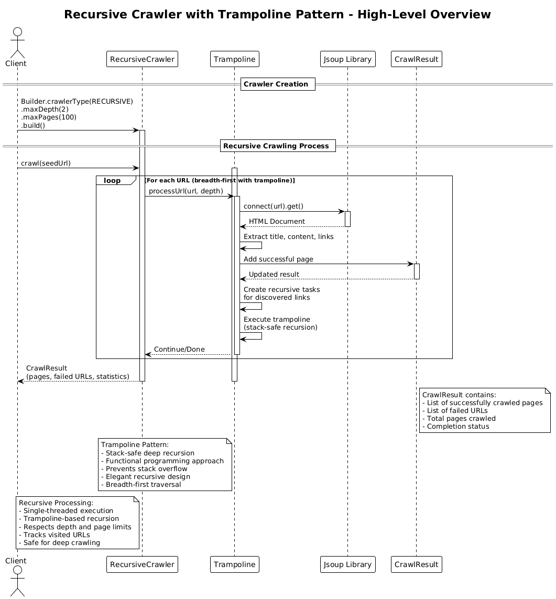

# Recursive Crawler (v3)

## Core Concept

The Recursive Crawler implements a **single-threaded, functional programming** pattern using the **trampoline technique**. It uses recursion to traverse the web graph while avoiding stack overflow through a sophisticated trampoline mechanism that converts recursive calls into iterative loops.

## How It Works

1. **Initialization**: The client creates a crawler using the builder pattern, specifying constraints like maximum depth and maximum pages.

2. **Trampoline Pattern**:
   - Instead of direct recursion, the crawler uses a `Trampoline` class that wraps recursive operations
   - Each recursive step returns either a `Done` result or a `More` continuation
   - The trampoline repeatedly executes continuations until a final result is reached
   - This prevents stack overflow even with deep recursion

3. **Recursive Processing**:
   - Starting with the seed URL, the crawler recursively processes each page
   - For each URL:
     - Fetch the HTML document using Jsoup
     - Extract the page title and content
     - Parse all links on the page
     - Add the page to the result set
     - Recursively process discovered links (if depth limit allows)
   - The trampoline ensures all recursive calls are stack-safe

4. **Result**: Returns a `CrawlResult` containing all crawled pages, failed URLs, and statistics.

## Key Characteristics

- **Functional Programming**: Elegant recursive design with immutable data structures
- **Stack Safety**: Trampoline pattern prevents stack overflow in deep recursion
- **Single-threaded**: Simple, predictable execution model
- **Breadth-First Traversal**: Processes pages level by level
- **Memory Efficient**: No explicit queue management needed
- **Elegant Code**: Clean, functional approach to web crawling

## Trampoline Pattern Benefits

- **Stack Safety**: Converts recursive calls into iterative loops
- **Deep Recursion**: Can handle arbitrarily deep web graphs
- **Functional Style**: Maintains the elegance of recursive programming
- **No Explicit Loops**: Recursive logic without manual iteration

## Architecture Pattern

The recursive approach implements the **Trampoline Pattern** for stack-safe recursion:

```
function crawlRecursive(url, depth):
    if depth > maxDepth: return Done(result)

    page ← fetch(url)
    result.add(page)

    tasks ← []
    for link in page.links:
        tasks.add(() -> crawlRecursive(link, depth + 1))

    return More(() -> trampoline(tasks))

// Trampoline execution
while (step = trampoline.step()) is More:
    trampoline = step.continuation()
return step.result()
```

Key insight: The trampoline converts recursive calls into iterative loops, preventing stack overflow while maintaining the elegance of functional programming.

## Diagram Reference



## Use Case

Choose Recursive (v3) for elegant functional programming and deep recursion without stack overflow.
