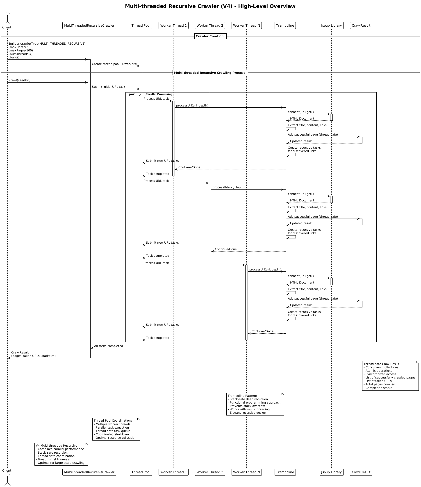

# Multi-threaded Iterative Crawler (v4)

## Core Concept

The Multi-threaded Iterative Crawler combines the **best of both worlds**: it merges the parallel processing power of the Producer-Consumer pattern with an efficient iterative approach. This creates a highly performant crawler implementation that avoids stack overflow issues through iterative processing rather than recursion.

## How It Works

1. **Initialization**:
   - The client creates a crawler specifying max depth, max pages, and **number of threads**
   - An `ExecutorService` thread pool is created with N worker threads
   - A shared `BlockingQueue` serves as the URL frontier
   - Thread-safe collections manage shared state

2. **Hybrid Architecture**:
   - **Producer-Consumer Layer**: Multiple worker threads process URLs in parallel
   - **Iterative Layer**: Each worker uses iterative while loops for processing
   - **Thread Coordination**: Synchronized access to shared resources

3. **Parallel Iterative Processing**:
   - The seed URL is added to the queue
   - Worker threads continuously poll the queue for URLs to process
   - Each worker:
     - Takes a URL from the queue (blocks if empty)
     - Iteratively processes the page using while loops
     - Fetches and parses the page with Jsoup
     - Extracts content and links
     - Adds the page to thread-safe result collections
     - **Produces** new URLs by adding discovered links back to the queue
   - This continues until all URLs are processed and the queue is empty

4. **Thread-Safe Iterative Processing**:
   - Each worker maintains its own iterative processing loop
   - Shared state (visited URLs, results) is accessed through thread-safe collections
   - Iterative operations avoid stack overflow issues
   - No interference between parallel iterative operations

5. **Clean Shutdown**:
   - Uses the **poison pill pattern** for coordinated shutdown
   - Each worker completes its current iterative operation before terminating
   - The executor awaits termination of all threads

6. **Result**: Returns a `CrawlResult` with pages, failures, and performance statistics.

## Key Characteristics

- **Maximum Performance**: Parallel processing with efficient iterative approach
- **Hybrid Pattern**: Combines Producer-Consumer and Iterative patterns
- **Thread-Safe Iteration**: Multiple iterative workers processing in parallel
- **Scalable**: Performance scales with thread count
- **Stack Safety**: Iterative approach avoids stack overflow issues
- **Complex Coordination**: Sophisticated synchronization between threads

## Advanced Features

- **Parallel Iterative Workers**: Each thread has its own iterative processing loop
- **Thread-Safe Collections**: ConcurrentHashMap, AtomicInteger, synchronized lists
- **Coordinated Shutdown**: Poison pill pattern with iterative operation completion
- **Optimal Resource Usage**: Balances parallelism with memory efficiency

## Architecture Pattern

The hybrid approach combines **Producer-Consumer** and **Iterative** patterns:

```
Shared Queue ← [seed URL]
Visited ← ConcurrentHashMap
Thread Pool ← N workers

Workers (parallel):
    while true:
        url ← queue.poll(timeout)
        if url is POISON_PILL: break

        // Each worker processes iteratively
        page ← fetchPage(url)
        links ← extractLinks(page)

        for link in links:
            if shouldFollow(link) and not visited(link):
                queue.offer(link)  // producer role
```

Key insight: This hybrid pattern achieves maximum performance by combining parallel processing with efficient iterative processing, where each thread maintains its own iterative processing loop.

## Diagram Reference



## Use Case

Choose Multi-threaded Iterative (v4) for large deep sites and maximum performance.
