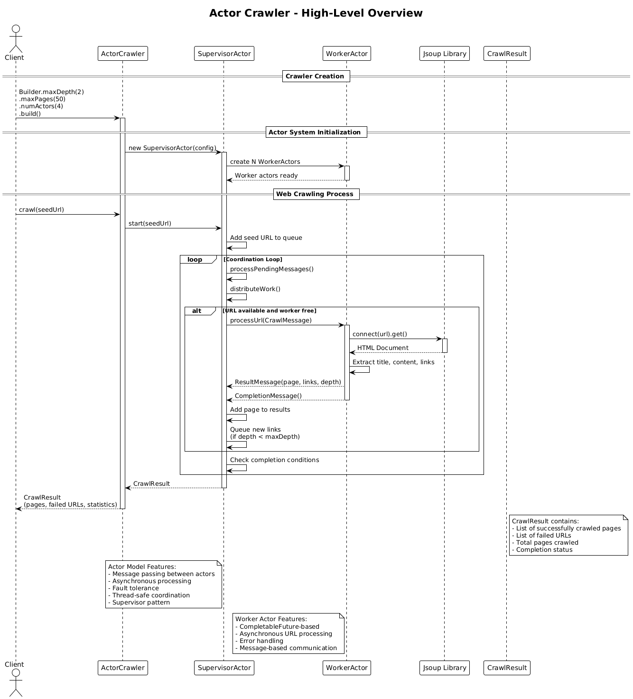

# Actor Crawler (v5)

## Core Concept

The Actor Crawler implements the **Actor Model pattern** using **CompletableFuture-based actors** and **asynchronous message passing**. It uses a supervisor-worker architecture where actors communicate through immutable messages, providing fault tolerance, loose coupling, and high scalability for concurrent web crawling operations.

## How It Works

1. **Initialization**:
   - The client creates a crawler specifying max depth, max pages, and **number of actors**
   - A `SupervisorActor` is created to coordinate the crawling process
   - Multiple `WorkerActor` instances are created for parallel URL processing
   - Thread-safe collections manage shared state and message queues

2. **Actor System Architecture**:
   - **Supervisor Actor**: Coordinates the overall crawling process, manages worker actors, and aggregates results
   - **Worker Actors**: Process individual URLs asynchronously using CompletableFuture
   - **Message Passing**: Actors communicate through immutable message objects (CrawlMessage, ResultMessage, ErrorMessage, CompletionMessage)
   - **Asynchronous Processing**: All operations are non-blocking and use CompletableFuture for async execution

3. **Message-Driven Processing**:
   - The seed URL is wrapped in a `CrawlMessage` and sent to the supervisor
   - The supervisor distributes `CrawlMessage` objects to available worker actors
   - Each worker actor:
     - Receives a `CrawlMessage` with URL and depth information
     - Fetches and parses the page with Jsoup asynchronously
     - Extracts content and links
     - Sends back a `ResultMessage` with the page data and discovered links
     - Sends a `CompletionMessage` to signal task completion
   - The supervisor processes messages and queues new URLs for crawling

4. **Coordination Loop**:
   - The supervisor runs a coordination loop that:
     - Processes pending messages from worker actors
     - Distributes new work to available workers
     - Tracks visited URLs to avoid duplicates
     - Aggregates results from all workers
     - Detects when crawling is complete
   - Uses thread-safe collections for coordination without explicit locks

5. **Fault Tolerance**:
   - Each actor operates independently and can fail without affecting others
   - Error messages are handled gracefully and logged
   - The supervisor pattern provides fault isolation
   - Asynchronous processing prevents blocking on individual failures

6. **Result**: Returns a `CrawlResult` with pages, failures, and performance statistics.

## Key Characteristics

- **Actor Model**: Message-passing concurrency with no shared mutable state
- **Asynchronous Processing**: CompletableFuture-based actors for non-blocking operations
- **Fault Tolerance**: Supervisor pattern provides fault isolation and recovery
- **Loose Coupling**: Actors communicate only through immutable messages
- **High Scalability**: Can handle large numbers of concurrent operations
- **Thread-Safe Design**: Uses concurrent collections and atomic operations
- **Message-Driven**: All coordination happens through message passing

## Actor Model Benefits

- **No Shared State**: Actors don't share mutable state, eliminating race conditions
- **Fault Isolation**: Failure of one actor doesn't affect others
- **Location Transparency**: Actors can be distributed across different machines
- **Elastic Scaling**: Can dynamically add or remove actors based on load
- **Natural Concurrency**: Message passing is inherently concurrent and safe

## Message Types

- **CrawlMessage**: Request to crawl a specific URL at a given depth
- **ResultMessage**: Successful crawl result with page data and discovered links
- **ErrorMessage**: Error that occurred while crawling a URL
- **CompletionMessage**: Signal that a worker has completed its current task

## Architecture Pattern

The actor-based approach implements the **Actor Model** with message passing:

```
SupervisorActor ← [seed URL]
MessageQueue ← []
WorkerActors ← [N actors]

Supervisor Loop:
    while not complete:
        processMessages()  // Handle ResultMessage, ErrorMessage, CompletionMessage
        distributeWork()   // Send CrawlMessage to available workers
        checkCompletion()  // Check if crawling is complete

Worker Actors (parallel):
    while active:
        message ← receive(CrawlMessage)
        page ← fetch(message.url)  // async with CompletableFuture
        links ← extractLinks(page)
        send(ResultMessage(page, links, depth))
        send(CompletionMessage())
```

Key insight: The actor model eliminates shared mutable state by using message passing, providing natural fault tolerance and the ability to scale across distributed systems.

## Diagram Reference



## Use Case

Choose Actor (v5) for fault-tolerant, distributed systems and message-driven concurrency.
