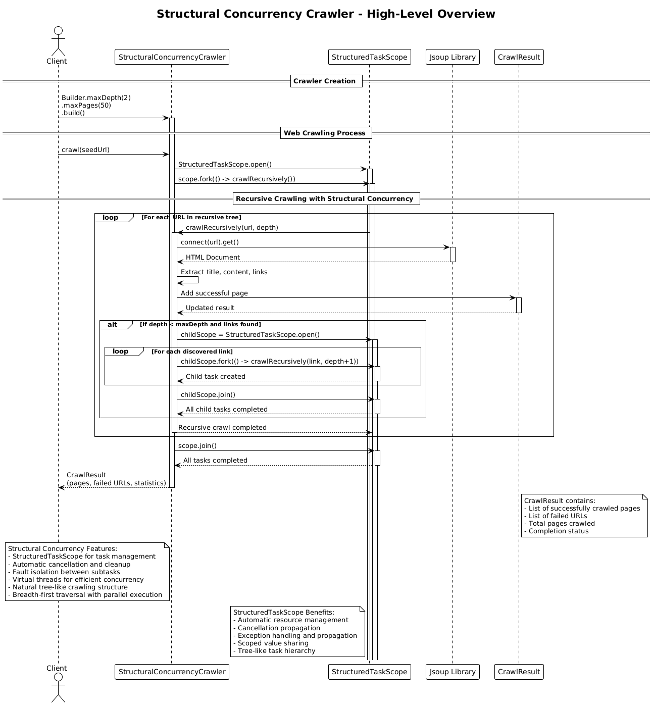

# Structural Concurrency Crawler (v7)

## Core Concept

The Structural Concurrency Crawler implements **Java 25's structural concurrency** using `StructuredTaskScope` for managing concurrent subtasks within well-defined scopes. It provides automatic resource management, cancellation propagation, and fault isolation while maintaining a natural tree-like crawling structure.

## How It Works

1. **Initialization**:
   - The client creates a crawler specifying max depth, max pages, and timeout settings
   - Thread-safe collections manage shared state for coordination
   - Virtual threads provide efficient concurrency without thread pool overhead

2. **Structured Concurrency Architecture**:
   - **StructuredTaskScope**: Manages concurrent subtasks within well-defined scopes
   - **Automatic Resource Management**: Scopes automatically clean up resources when closed
   - **Cancellation Propagation**: Cancellation automatically propagates to all subtasks
   - **Fault Isolation**: Failures in one branch don't affect others
   - **Virtual Threads**: Efficient concurrency without traditional thread pool overhead

3. **Recursive Processing with Structured Scopes**:
   - The main crawl operation creates a `StructuredTaskScope`
   - For each URL, the crawler recursively processes it within the scope
   - For discovered links, child scopes are created for parallel processing
   - Each scope manages its own set of concurrent subtasks
   - Automatic cleanup occurs when scopes close

4. **Structured Task Management**:
   - `scope.fork()` creates subtasks for concurrent execution
   - `scope.join()` waits for all subtasks to complete
   - Automatic cancellation when scope closes
   - Exception handling and propagation through scope hierarchy

5. **Virtual Thread Integration**:
   - Virtual threads provide efficient concurrency
   - No explicit thread pool management required
   - Automatic scaling based on workload
   - Reduced memory overhead compared to platform threads

6. **Result**: Returns a `CrawlResult` with pages, failures, and performance statistics.

## Key Characteristics

- **Structured Concurrency**: Java 25's StructuredTaskScope for task management
- **Automatic Resource Management**: Scopes handle cleanup automatically
- **Cancellation Propagation**: Automatic cancellation throughout scope hierarchy
- **Fault Isolation**: Failures isolated within scope boundaries
- **Virtual Threads**: Efficient concurrency without thread pool overhead
- **Natural Tree Structure**: Recursive scoping matches web topology
- **Simplified Error Handling**: Automatic exception propagation and handling
- **Modern Java Features**: Leverages latest Java concurrency improvements

## Structural Concurrency Benefits

- **Automatic Cleanup**: Resources managed automatically by scopes
- **Cancellation Safety**: Automatic cancellation propagation prevents resource leaks
- **Fault Isolation**: Scope boundaries provide natural fault isolation
- **Simplified Code**: Less boilerplate for concurrent operations
- **Virtual Thread Efficiency**: Better resource utilization than traditional threads
- **Exception Safety**: Automatic exception handling and propagation
- **Modern Design**: Leverages Java's latest concurrency features

## Architecture Pattern

The structural concurrency approach implements **StructuredTaskScope** for automatic resource management:

```
try (var scope = StructuredTaskScope.open()) {
    var mainTask = scope.fork(() -> crawlRecursively(seedUrl, 0))

    function crawlRecursively(url, depth):
        if depth > maxDepth: return

        page ← fetch(url)
        results.add(page)

        if depth < maxDepth:
            try (var childScope = StructuredTaskScope.open()) {
                for link in page.links:
                    childScope.fork(() -> crawlRecursively(link, depth + 1))
                childScope.join()  // automatic cleanup
            }

    scope.join()  // automatic cleanup
}
```

Key insight: StructuredTaskScope provides automatic resource management, cancellation propagation, and fault isolation, making concurrent programming safer and more predictable.

## Diagram Reference



## Use Case

Choose Structural Concurrency (v7) for modern Java applications requiring automatic resource management and virtual thread efficiency.
