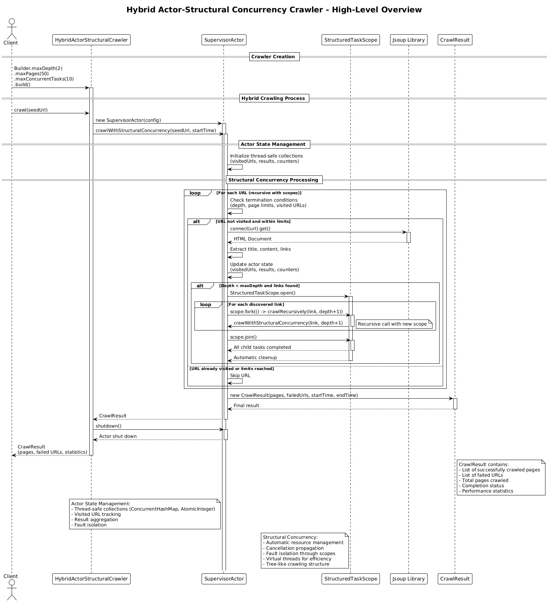

# Hybrid Actor-Structural Concurrency Crawler (v8)

## Core Concept

The Hybrid Actor-Structural Concurrency Crawler implements a **hybrid approach** that combines the best of both the Actor Model pattern and Java 25's structural concurrency. It uses a supervisor actor for coordination, state management, and fault tolerance, while leveraging StructuredTaskScope for actual crawling work with automatic resource management.

## How It Works

1. **Initialization**:
   - The client creates a crawler specifying max depth, max pages, and **maximum concurrent tasks**
   - A `SupervisorActor` is created to coordinate the crawling process
   - Thread-safe collections manage shared state (visited URLs, results, counters)
   - Virtual threads provide efficient concurrency without thread pool overhead

2. **Hybrid Architecture**:
   - **Actor Layer**: Supervisor actor manages state, coordination, and message processing
   - **Structural Concurrency Layer**: StructuredTaskScope handles actual crawling work
   - **State Management**: Thread-safe collections (ConcurrentHashMap, AtomicInteger, synchronized lists)
   - **Resource Management**: Automatic cleanup and cancellation propagation through scopes

3. **Recursive Processing with Hybrid Coordination**:
   - The supervisor actor processes URLs using structural concurrency
   - For each URL:
     - Check termination conditions and visited URLs (actor state management)
     - Fetch and parse the page with Jsoup
     - Extract content and links
     - Update actor state (visited URLs, results, counters)
     - For discovered links, create child scopes for parallel processing
   - Each child scope manages its own set of concurrent subtasks
   - Automatic cleanup occurs when scopes close

4. **Structured Task Management**:
   - `StructuredTaskScope.open()` creates scopes for concurrent execution
   - `scope.fork()` creates subtasks for parallel crawling
   - `scope.join()` waits for all subtasks to complete
   - Automatic cancellation when scope closes
   - Exception handling and propagation through scope hierarchy

5. **Actor-Based State Coordination**:
   - Supervisor actor maintains thread-safe state collections
   - Visited URL tracking prevents duplicate crawling
   - Result aggregation across all concurrent tasks
   - Fault isolation between actor coordination and crawling tasks

6. **Result**: Returns a `CrawlResult` with pages, failures, and performance statistics.

## Key Characteristics

- **Hybrid Architecture**: Combines Actor Model coordination with structural concurrency execution
- **Automatic Resource Management**: StructuredTaskScope handles cleanup automatically
- **Fault Isolation**: Actor coordination failures don't affect crawling tasks, and scope boundaries provide fault isolation
- **Virtual Thread Efficiency**: Leverages virtual threads for optimal I/O operations
- **Natural Tree Structure**: Recursive scoping matches web topology
- **Thread-Safe Coordination**: Actor-based state management with concurrent collections
- **Modern Java Features**: Leverages Java 25's latest concurrency improvements

## Hybrid Architecture Benefits

- **Best of Both Worlds**: Actor model coordination with structural concurrency execution
- **Automatic Cleanup**: Resources managed automatically by scopes
- **Fault Tolerance**: Supervisor pattern provides fault isolation and recovery
- **Cancellation Safety**: Automatic cancellation propagation prevents resource leaks
- **Simplified Coordination**: Actor-based state management with thread-safe collections
- **Virtual Thread Efficiency**: Better resource utilization than traditional threads
- **Exception Safety**: Automatic exception handling and propagation

## Architecture Pattern

The hybrid approach implements **Actor-Coordinated Structural Concurrency**:

```
SupervisorActor ← [seed URL]
ThreadSafeState ← {visitedUrls, results, counters}
StructuredTaskScope ← []

Supervisor Loop:
    while not complete:
        checkTerminationConditions()  // Actor state management
        processUrlWithStructuralConcurrency()  // StructuredTaskScope execution

        if depth < maxDepth:
            try (var childScope = StructuredTaskScope.open()) {
                for link in discoveredLinks:
                    childScope.fork(() -> crawlRecursively(link, depth + 1))
                childScope.join()  // automatic cleanup
            }

Structural Concurrency Execution:
    for each URL:
        fetchAndParsePage()  // I/O with virtual threads
        updateActorState()   // Thread-safe state updates
        createChildScopes()  // Parallel processing
        automaticCleanup()   // Scope-based resource management
```

Key insight: This hybrid pattern provides the coordination benefits of the actor model with the resource management benefits of structural concurrency, creating a robust and efficient crawling system.

## Diagram Reference



## Use Case

Choose Hybrid Actor-Structural (v8) for enterprise systems requiring maximum fault tolerance with both actor coordination and automatic resource management.
